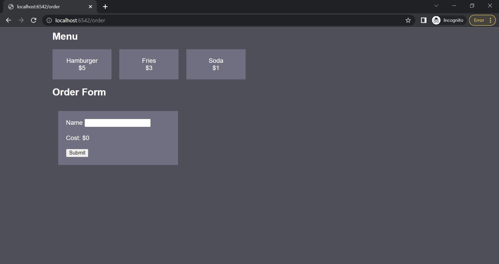
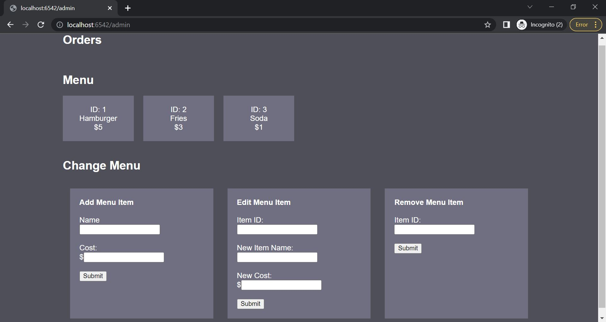

# Restaurant Management System
The Restaurant Management System is a web application built with FastAPI 
and MySQL that provides functionalities for managing menu items and processing
orders in a restaurant. It allows users to view the menu, place orders, and 
perform administrative tasks such as adding, editing, and removing menu items.

The following images display how the order and admin page looks like.   
#### Order page:

#### Admin page:

## Features
- View the menu items and place orders: [Demo](https://youtu.be/TJcFTamXOVo)

   Customers can browse the menu items available in the restaurant, and place 
orders by selecting the items from the menu, provide their name and quantity, 
and submit orders.

- Process orders: [Demo](https://youtu.be/9FpUjJbRTRo)

   Admin users can view and update the status of the orders (e.g., mark an order as complete).     

- Manage menu items: [Demo](https://youtu.be/ETzMMLGTdHU)

   Admin users can add new menu items, edit existing items (name and cost), and remove items from the menu.     

## Technologies Used

FastAPI: A modern, fast (high-performance) web framework for building APIs 
with Python.

MySQL: A popular open-source relational database management system.

HTML and CSS: Used for creating the user interface of the web application.

JavaScript: Used for handling dynamic interactions on the client-side.

## Installation

1. Clone the repository:

   In your IDE's terminal run the following command:

    ``
    git clone <repository-url>
    ``

2. Make sure to have the following packages:
   - fastapi
   - uvicorn
   - mysql.connector
   - dotenv
   
   If you don't, run the following in the command line:

   ``
   pip install fastapi uvicorn mysql-connector-python python-dotenv
   ``

3. Set up the MySQL database:

   Make sure you have MySQL installed and running on your system.

   - In your IDE, create a new file and name it credentials.env
   - In it, have the following:

         MYSQL_HOST = 127.0.0.1
         MYSQL_USER = root
         MYSQL_PASSWORD = [Your Password]
         MYSQL_DATABASE = ProductItems

   - Go over to the init_db.py file, and run it.
     - This will create the necessary tables for you.

4. Run the application:

   If running from terminal, run the following command:

   ``
   python app.py
   ``
   

5. Access the application in your browser:

   In your web browser, type in: 

   `localhost:6542/order` to access the order page, view the menu items and place orders.

   `localhost:6542/admin` to access the admin page, perform administrative 
tasks such as managing menu items and processing orders. 

## API Endpoints
GET /items: Retrieves all menu items.  
GET /orders: Retrieves all orders.  
POST /ordering: Submits an order.   
POST /update_status: Updates the status of an order.  
POST /add_item: Adds a new menu item.  
POST /edit_item: Edits an existing menu item.   
POST /remove_item: Removes a menu item.   
